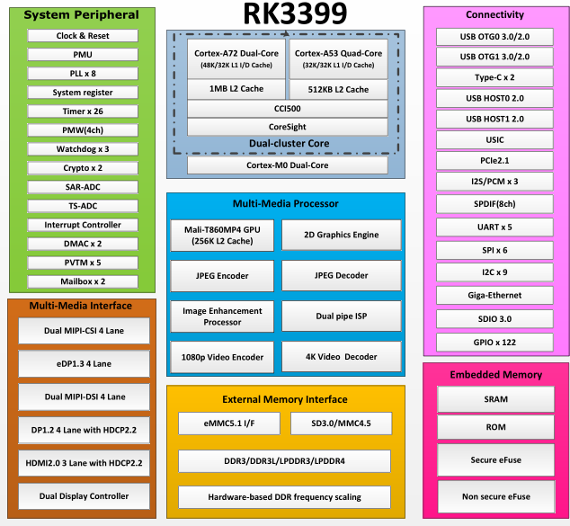

# [RK3399](https://github.com/sochub/RK3399)

 

#### [Vendor](https://github.com/sochub/Vendor)：[rock-chips](https://github.com/sochub/rockchips)
#### [ARM](https://github.com/sochub/ARM)：[cortex A72 + A53](https://github.com/sochub/CA72)
#### [Level](https://github.com/sochub/Level)：

## [芯片描述](https://github.com/sochub/RK3399/wiki) 

[RK3399](http://www.rock-chips.com/a/cn/product/RK33xilie/2016/0419/759.html) 是瑞星微2016发布的旗舰处理器，等效主频2.0GHz，安兔兔跑分80000+ ，也是开源硬件中最顶级的处理器之一，适合较高端嵌入式设备

### [收录资源](https://github.com/sochub/RK3399)

* [文档](docs/)
* [linux](linux/)

### [关联资源](https://github.com/sochub)

* [aarch-linux编译](https://github.com/sochub/aarch-linux)
* [arm-linux-eabihf编译](https://github.com/sochub/arm-linux-eabihf)

### [选型建议](https://github.com/sochub)

[RK3399](https://github.com/sochub/RK3399)是瑞星微旗舰级处理器，也是开源市场上少有的高性能产品

##  [SoC资源平台](http://www.qitas.cn)  

